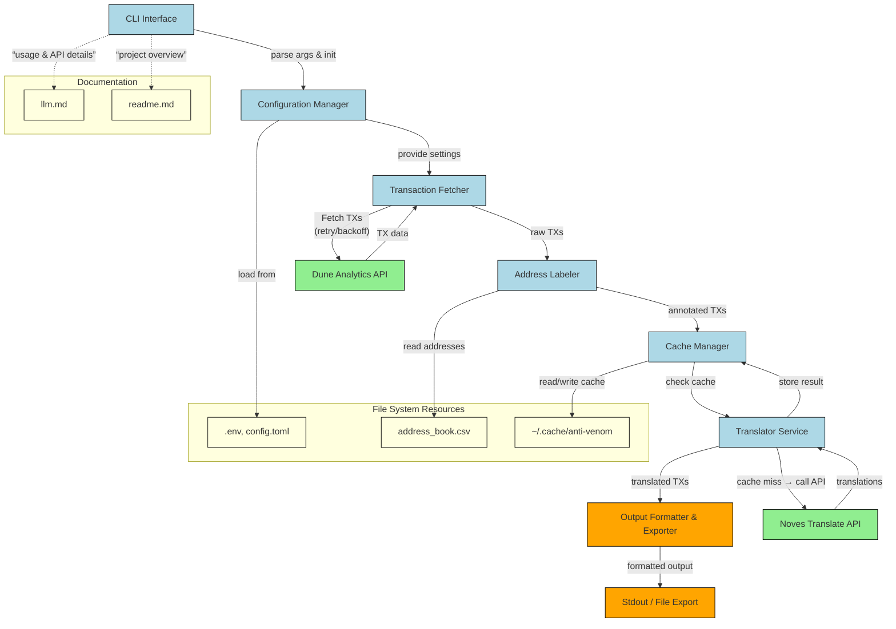

```mermaid
flowchart TD
    %% Core pipeline stages (blue)
    CLI["CLI Interface"]:::core
    Config["Configuration Manager"]:::core
    Fetcher["Transaction Fetcher"]:::core
    Labeler["Address Labeler"]:::core
    Translator["Translator Service"]:::core
    Cache["Cache Manager"]:::core
    Formatter["Output Formatter & Exporter"]:::formatter
    Output["Stdout / File Export"]:::formatter

    %% External services (green)
    Dune["Dune Analytics API"]:::external
    Noves["Noves Translate API"]:::external

    %% File system resources (yellow)
    subgraph "File System Resources"
        FS1[".env, config.toml"]:::file
        FS2["address_book.csv"]:::file
        FS3["~/.cache/anti-venom"]:::file
    end

    %% Documentation (yellow)
    subgraph Documentation
        LLMD["llm.md"]:::file
        READMD["readme.md"]:::file
    end

    %% Data flow
    CLI -->|"parse args & init"| Config
    Config -->|"provide settings"| Fetcher
    Fetcher -->|"Fetch TXs\n(retry/backoff)"| Dune
    Dune -->|"TX data"| Fetcher
    Fetcher -->|"raw TXs"| Labeler
    Labeler -->|"annotated TXs"| Cache
    Cache -->|"check cache"| Translator
    Translator -->|"cache miss → call API"| Noves
    Noves -->|"translations"| Translator
    Translator -->|"store result"| Cache
    Translator -->|"translated TXs"| Formatter
    Formatter -->|"formatted output"| Output

    %% File system usage arrows
    Config -->|"load from"| FS1
    Labeler -->|"read addresses"| FS2
    Cache -->|"read/write cache"| FS3

    %% Documentation links
    CLI -.->|“usage & API details”| LLMD
    CLI -.->|“project overview”| READMD

    %% Click Events
    click CLI "https://github.com/cipher-rc5/anti-venom/blob/main/anti-venom.nu"
    click Config "https://github.com/cipher-rc5/anti-venom/blob/main/.env.example"
    click Config "https://github.com/cipher-rc5/anti-venom/blob/main/.config.example"
    click Fetcher "https://github.com/cipher-rc5/anti-venom/blob/main/anti-venom.nu"
    click Labeler "https://github.com/cipher-rc5/anti-venom/blob/main/anti-venom.nu"
    click Translator "https://github.com/cipher-rc5/anti-venom/blob/main/anti-venom.nu"
    click Cache "https://github.com/cipher-rc5/anti-venom/tree/main/~/.cache/anti-venom"
    click Formatter "https://github.com/cipher-rc5/anti-venom/blob/main/anti-venom.nu"
    click FS2 "https://github.com/cipher-rc5/anti-venom/blob/main/address_book_example.csv"
    click LLMD "https://github.com/cipher-rc5/anti-venom/blob/main/llm.md"
    click READMD "https://github.com/cipher-rc5/anti-venom/blob/main/readme.md"

    %% Styles
    classDef core fill:#ADD8E6,stroke:#000,stroke-width:1px
    classDef external fill:#90EE90,stroke:#000,stroke-width:1px
    classDef file fill:#FFFFE0,stroke:#000,stroke-width:1px
    classDef formatter fill:#FFA500,stroke:#000,stroke-width:1px
```
