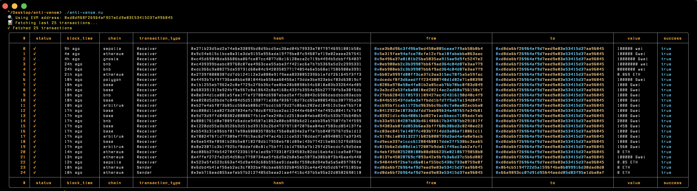

# Anti-Venom 🐍⚡

A powerful Nushell script for fetching and analyzing EVM blockchain transactions with advanced features like transaction translations, address labeling, and intelligent caching.



## Features

- 🔍 **Transaction Fetching**: Query transactions for any EVM address across multiple chains
- 🌐 **Multi-Chain Support**: Works with Ethereum, BSC, Polygon, and other EVM chains
- 📝 **Transaction Translations**: Human-readable descriptions via Noves Translate API
- 🏷️ **Address Labeling**: Identify known addresses (exchanges, contracts, etc.)
- 💾 **Smart Caching**: Cache translations to reduce API calls
- 🎨 **Beautiful Output**: Colorized terminal output with multiple format options
- ⚡ **Retry Logic**: Automatic retry with exponential backoff
- 📊 **Multiple Export Formats**: Table, JSON, CSV, and compact views

## Prerequisites

- [Nushell](https://www.nushell.sh/) (0.91.0 or later)
- API Keys:
  - [Dune Analytics API Key](https://dune.com/docs/api/) (SIM_API_KEY)
  - [Noves Translate API Key](https://docs.noves.fi/) (NOVES_API_KEY)

## Installation

1. Clone the repository:
```bash
git clone https://github.com/yourusername/anti-venom.git
cd anti-venom
```

2. Make the script executable:
```bash
chmod +x anti-venom.nu
```

3. Initialize the configuration:
```bash
./anti-venom.nu init
```

4. Copy the example .env file and add your API keys:
```bash
cp .env.example .env
# Edit .env with your favorite editor
```

## Configuration

### Environment Variables (.env)

```bash
# Your default EVM address
EVM_ADDR=0xYourAddressHere

# Required API Keys
SIM_API_KEY=your-dune-api-key
NOVES_API_KEY=your-noves-api-key
```

### Config File (~/.config/evm-fetcher/config.toml)

The config file supports various customization options:

```toml
evm_addr = "0xYourDefaultAddress"
default_limit = 25
cache_dir = "~/.cache/anti-venom"
address_book_path = "address_book.csv"
timestamp_format = "relative"           # Options: relative, unix, human
sort_by = "block_time"                  # Options: block_time, value, nonce
sort_order = "desc"                     # Options: asc, desc
```

### Address Book (address_book.csv)

Label known addresses for better readability:

```csv
address,chain,label
0x742d35Cc6634C0532925a3b844Bc9e7595f5b9e1,eth,Binance Hot Wallet
0xBE0eB53F46cd790Cd13851d5EFf43D12404d33E8,eth,Binance Cold Wallet
```

## Usage

### Basic Usage

Fetch transactions for your default address:
```bash
./anti-venom.nu
```

Fetch transactions for a specific address:
```bash
./anti-venom.nu --address 0x742d35Cc6634C0532925a3b844Bc9e7595f5b9e1
```

### Advanced Options

```bash
# Fetch with transaction translations
./anti-venom.nu --translate

# Use address labels from address book
./anti-venom.nu --labels

# Export to different formats
./anti-venom.nu --format json --export transactions.json
./anti-venom.nu --format csv --export transactions.csv

# Filter by chain
./anti-venom.nu --chain eth --limit 50

# Custom timestamp format
./anti-venom.nu --timestamp-format unix

# Sort by value in ascending order
./anti-venom.nu --sort-by value --sort-order asc
```

### Commands

```bash
# Initialize configuration
./anti-venom.nu init

# Check configuration status
./anti-venom.nu --show-config

# Clear translation cache
./anti-venom.nu clear-cache
```

## Output Formats

- **table** (default): Rich terminal table with colors
- **json**: JSON format for programmatic use
- **csv**: CSV format for spreadsheet import
- **compact**: Simplified table with essential fields

## Examples

### Analyze Recent High-Value Transactions
```bash
./anti-venom.nu --translate --sort-by value --sort-order desc --limit 100
```

### Export Labeled Transactions for Specific Chain
```bash
./anti-venom.nu --chain eth --labels --format csv --export eth_transactions.csv
```

### Monitor Address with Human-Readable Timestamps
```bash
./anti-venom.nu --address 0xA090e606E30bD747d4E6245a1517EbE430F0057e --timestamp-format human
```

## Troubleshooting

### API Key Issues
- Ensure your API keys are correctly set in the `.env` file
- Run `./anti-venom.nu --config` to verify configuration status

### Permission Errors
- Make sure the script is executable: `chmod +x anti-venom.nu`
- Check write permissions for cache directory

### Rate Limiting
- The script includes automatic retry logic with exponential backoff
- Consider reducing `--limit` if experiencing consistent failures


### author

**@author:** ℭ𝔦𝔭𝔥𝔢𝔯
**gh:** cipher-rc5
**tg**: cipher0091

## License

MIT License - see LICENSE file for details

## Contributing

Contributions are welcome! Please feel free to submit a Pull Request.

## Acknowledgments

- Built with [Nushell](https://www.nushell.sh/)
- Transaction data from [Dune Analytics](https://dune.com/)
- Transaction translations by [Noves](https://noves.fi/)

---

**Note**: Never commit your `.env` file or expose your API keys. Always use `.gitignore` to exclude sensitive files.
